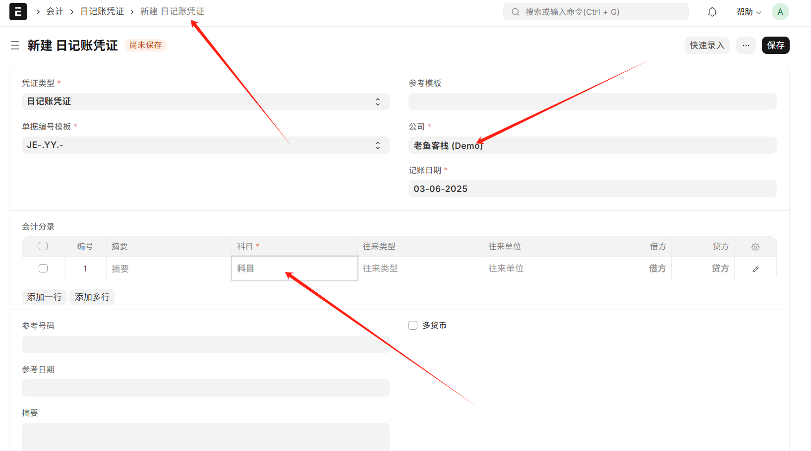

## 生产工单提交时报科目错误
解法：
把 400101 - 生产成本-基本生产成本 的科目类型 改成直接费用 


## 公司默认值不对
问题：
新建 日记账凭证 的时候，会计科目选项出不来
解法：
修改 会话默认值 ，把公司名称修改正确 => 刷新页面再试




## Socket.IO 连接错误
网页控制台报错：
```shell
Error connecting to socket.io: Unauthorized: Error: getaddrinfo ENOTFOUND development.localhost
```

这是一个 DNS 解析错误，表明客户端无法将 development.localhost 域名解析为 IP 地址。
解决方案:
在 Linux/Mac 系统中，通常需要编辑 /etc/hosts 文件
在 Windows 系统中，需要编辑 C:\Windows\System32\drivers\etc\hosts 文件

添加以下内容：
```shell
127.0.0.1 development.localhost
```