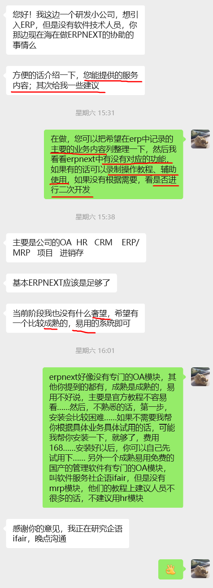

# 简介
ERPNext官网上的说明文档看不太懂，所以只好绕个弯路，参考专业且详细的`软件服务社的企语iFair`财务系统使用教程，在ERPNext中进行实操。

原本的目的，是通过我的实际操作，展现一下ERPNext操作简单、功能实用的优点，但是老鱼水平有限，难免弄巧成拙😓

所以，如果您看了我的操作，反而觉得ERPNext很难用，那一定是个误会，您应该亲自去体验，或者找专业的ERPNext服务商😄

很可能，演示的很多内容您的业务中用不到，然后用得到的又没演示，欢迎找老鱼定制付费服务，纯纯的白菜价🥬

另外,在哔哩哔哩上观看是可以倍数播放的哦

>软件服务社官网：http://www.fuwushe.org/

## 怎么不直接用`软件服务社的企语iFair`？
`企语iFair`的优点：国产、永久免费、功能丰富、说明详细……

只是：
+ 暂时没看到MRP(物料需求计划)系统
+ ERPNext中会计和进销存业务联系得更加紧密
+ 不是开源的，只能由官方维护，像我这种游击队程序猿，没办法抄作业、二次开发

## 财务软件是不是必须经过政府审批？
摘自软件服务社：http://www.fuwushe.org/jsp/faq/question.jsp?page=faq&id=402881893627306401362998f63d0001
>经常有人问起，财务软件是不是必须经过政府审批？如果问企业的财务人员，可能会有99%的回答是“必须”的。但真实的答案是：不需要。企业用什么财务软件，政府根本不限制！

>在很久很久以前（上个世纪90年代），财务软件确实是需要财政部审批的，但从1998年起，已经全面取消了审批。可以查阅下文（http://www.china.com.cn/chinese/law/244487.htm） ，下面的内容是其中的一部分：略……

>也就是说：从1998 年起即十多年前政府就没有审批财务软件这个说法了！但直到现在，国内仍有一些软件商或明或暗说自己是“通过政府审批的财务系统”或者说“官方认可的财务软件系统”，这只不过是……吹牛的😄

## ERPNext中的会计功能
就算没有政府关卡，ERPNext毕竟是国外开发的，其中的会计功能可能也不太契合国内环境，但是用来做企业内部财务管理也是极好的

## 进入主题
看b站演示https://space.bilibili.com/687821311 ……

## 蜻蜓点水
经过前面的实操，目测ERPNext能完成`进销存会记`信息管理任务，这次真帐实操到此就浅尝辄止了……

### 老板经典提问：
> 介绍一下，您能提供的服务内容；其次给我一些建议

### 提供的服务内容:
+ 如果您愿意亲自动手试用ERPNext，但是不会安装，我可以收费代劳，费用￥168
+ 如果您没时间、精力亲自试用，您可以整理好需要在ERPNext进行管理的代表性例子，我来替您试用，确认是否有现成的功能，满足贵公司的信息化管理需求，
  + 如果能，录制操作教程、辅助贵公司使用
  + 如果不能，进行二次开发

费用再议

### 建议:
+ 先把进销存用起来再说
  + 真能用好进销存，贵公司的信息化管理水平已经不低了
  + 使用过程中，就能知道ERPNext是不是好用
    + 如果好用，他不完善的、缺少的功能，你是会愿意花点钱去解决的
+ MRP功能不是刚需的话，可以试用软件服务社的企语看看