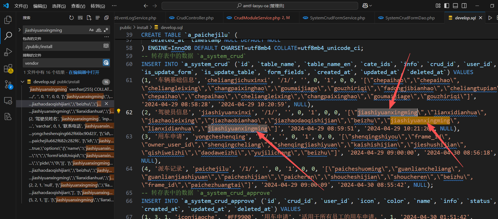

# 老鱼OA
搬运自 [众邦科技/陀螺匠OA办公系统↗开源版本](https://gitee.com/ZhongBangKeJi/tuoluojiang) 

功能极其丰富，`官方说明文档`非常详细

开源版本主体功能都在，可以不花一分钱使用起来，有条件也可以用收费版

## 试用
https://oa.laoyu.xin 可以自行注册账号试用

## 低代码功能
可以不用写代码，自己动手实现个性化的信息管理需求！

虽然功能还不够完善、细节有待改进，但是人家是真开源的！

官方有文档和视频教程，这里做点补充
### 问题修复
官方提供的`企业车辆管理`的例子，应该是因为升级导致演示的数据有问题，

自己学习操作的话，可以干脆删除掉演示数据，全部重新创建

这里，为了深入学习内部功能(偷懒)，使用修复旧数据的方式

1. 直接修改初始化数据
`public\install\develop.sql`中的 驾驶员信息 中的字段 `jiashiyuanxingming` 有重复，要删除多余的

1. 丢失关联的字段逐个修复