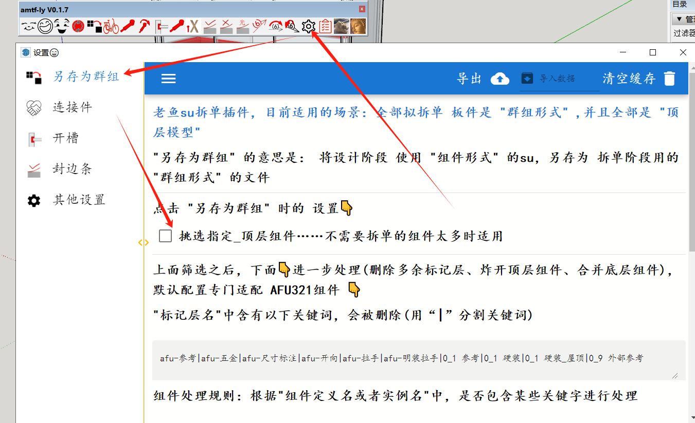
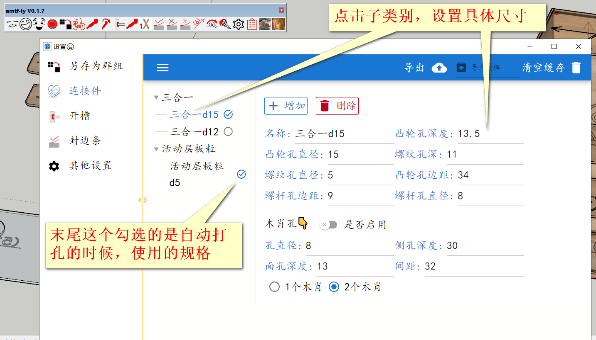
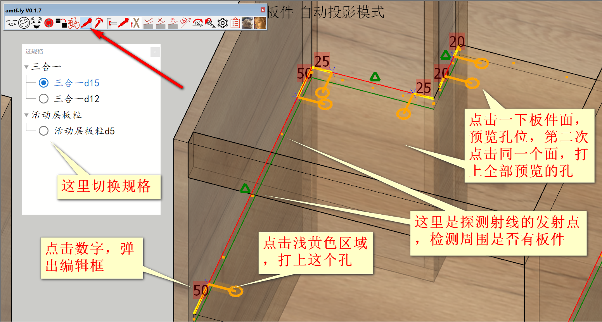
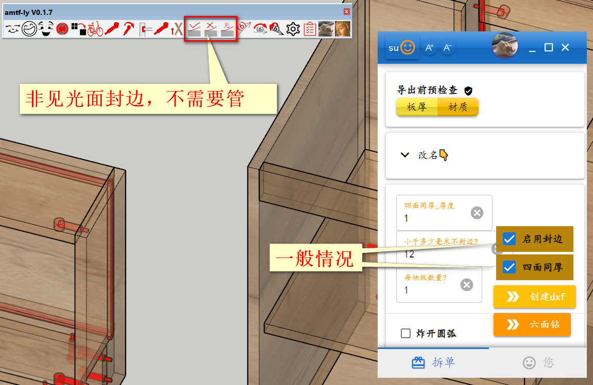
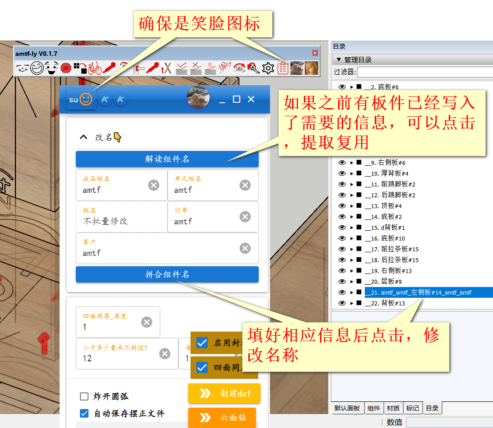

# 老鱼su拆单插件
## 涨价说明
+ 原算盘是，软件保持开源低价，主要靠收费技术服务维持运营，目前来看此路不通！所以涨价试试看。
+ 之前已付费开通相应功能的，不受影响(不用加钱)
+ 价格虽然会变，但是追求物美价廉的目标不会变
+ 涨价是想尝试吸引代销和代理技术支持，如果吸引力不够，在保证低于市场价的前提下，可能还会涨价
+ 如果涨价有疗效，也会有利于本插件继续完善

## 介绍
1. 主要功能：
   1. 给用`SketchUp`设计的柜子加上`三合一`等`五金件`孔位，导出成`dxf`文件
   2. 然后可以使用 天工或者云熙(有和谐版)，进行排版、生成加工nc代码
   3. 价格￥ `1680` 元
2. 不常用功能：
   1. 包括`见光面封边`、`导出ban文件`(对接六面钻)、`导出xml文件`
   2. 不常用功能，都还不完善，您确实用得到，付费后我再来完善
   3. 价格￥ `3680` 元
3. 会员注册：安装软件后，在用户界面自行注册……试用期30天……需要延长试用期的，可以联系老鱼
4. 使用交流优先选择在群里进行，抱团队的大腿……陌生朋友直接加微信也行，但是请注明来意
5. 本程序`完全开放源代码`，代码地址:[amtf-ly-su](https://gitee.com/yiguxianyun/amtf-ly-su)
6.  安装包链接：https://pan.baidu.com/s/1FMEDiQ0mhR9jzT0hM0dNtg 提取码：amtf

## 销售、技术支持合作
1. 欢迎代销，提成为销售价的`5%`
2. 欢迎技术支持，报酬为销售价的`15%`(目前客户少，可能的情况是，您先拉取新客户，然后对其提供技术支持)

## 安装
1. 解压`laoyu-su-go.rar` 到任意目录即可

    安装后首次运行，可能会提示下载 .net 基础文件，请按提示下载安装
    
2. 按照常规的su插件安装方法，安装`amtf_ly_版本号.rbz`

## 使用
### 注意事项！ 
1. 本插件主要对应`拆单阶段`，上游阶段为`设计阶段`
2. `设计阶段`推荐用`AFU321`，原则上只要是`su`模型都可以拆单
3. ~~`设计阶段`中需要开料的板件，需要是`组件`形式，不能是`群组`形式(后续可能会改进，取消该限制)~~
4. 进入`拆单阶段`后，板件尺寸如果需要`再次调整`:
   1. ~~不要再使用`缩放`的方式，可以使用su自带的`推/拉`功能，或者其他插件提供的`移动顶点`的功能~~
   2. ~~不要再旋转板件，板件坐标系需要和全局坐标系朝向保持一致~~
   3. 调整之后，需要点击`群组重生成`进行处理
5. 目前不支持柜子嵌套板件的形式，可以通过`改名`的方式形成层级关系

### 第一步! 双击`laoyu-su-go.exe`文件
### 第二步 `另存为群组`
   + 准备工作：首先用su画好柜子，可以使用afu321的动态组件、或者自己开发的动态组件，把su文件保存好！
   + 设置：点击老鱼su插件工具栏`设置`按钮，在弹出页面中，点击`另存为群组`，确认好设置选项
    可选项👇
      1. 如果是afu321组件，并且su模型中不需要开料的无关元素较少，可以直接使用默认值
      2. 如果su模型中不需要开料的元素较多(比方说墙顶地，软装都在模型里面)，则勾选`挑选指定_顶层组件`选项，根据情况可以进行进一步设置
      
   + 正式执行:点击工具栏的`另存为群组`按钮

      作用说明：将当前su文件(设计阶段用)，另存一份(拆单阶段用),然后找到含`板`的su组件,炸开重新转换成su群组，并且删除其他元素

       

### 自动档      
   + 设置：点击`设置`按钮，在弹出页面中，点击`连接件`、`开槽`，设置好三合一等尺寸规格
      
      

      
   + 正式执行:点击工具栏的`自动档`按钮

        

   + `自动档`布置的孔位不合理的时候，再进行手动布置

        
### 封边
除非是想精确控制见光面封边，否则不需要管工具栏中的三个图标，只需要在exe界面选中相应选项

    
### 纹理方向标签
    箭头方向为纹理方向，需要添加标签后才能导出dxf
### 板件规范命名
    在exe界面`改名`栏进行相应操作

### 材质对应关系

### 导出dxf

## 更新
<agx/>

