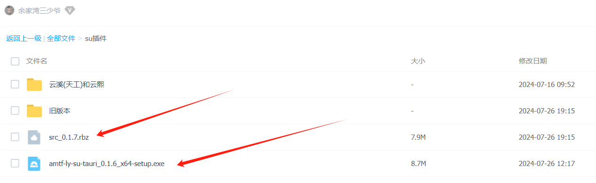

# 老鱼su拆单插件
1. 主要功能：给`SketchUp`设计的柜子加上`三合一`等`五金件`孔位，导出成`dxf`或者`ban`文件，对接机器进行加工
2. 收费：基础功能免费，其他功能按相应的 会员级别 授权
3. 会员级别：
   1. 充电会员 ￥ `88` 元，对应功能👉`导出dxf` (对接天工、云熙)
   2. 更上层楼会员 ￥ `666` 元，对应功能👉`见光面封边`、`导出ban文件`(对接六面钻)
       + 帮忙推广可以抵扣费用，1个自媒体平台发布1条推广信息，抵扣3元，获赞1个，抵扣1元，每天限额10元，总限额300元
4. 会员注册：安装软件后，在用户界面自行注册……收费功能试用期30天……新增的收费功能需要试用的，请联系老鱼增加试用期
5. 使用交流优先选择在群里进行，抱团队的大腿……陌生朋友直接加微信也行，但是请注明来意
6. 本程序`完全开放源代码`，代码地址:[amtf-ly-su](https://gitee.com/yiguxianyun/amtf-ly-su)
7. 安装包链接：https://pan.baidu.com/s/1FMEDiQ0mhR9jzT0hM0dNtg 提取码：amtf

## 安装
安装文件有两个👇

1. 点击外置exe程序(以后简称exe) `amtf-ly-su-tauri.exe` 进行安装

    安装后首次运行，可能会提示下载 .net 基础文件，请按提示下载安装
    

2. 下载su内置插件程序 `amtf_ly.rbz`，按照常规的su插件安装方法，进行安装

## 使用步骤
演示视频地址 https://space.bilibili.com/687821311/channel/seriesdetail?sid=4187682&ctype=0

1. 第一步! 开启外置exe程序
1. 第二步！ 点击`另存为群组`按钮，将设计阶段的su文件另存为拆单阶段使用的文件
     + 附注：
     老鱼su拆单插件，目前适用的场景：全部拟拆单 板件是 `群组形式` ,并且全部是 `顶层模型`(设计阶段使用组件形式，拆单阶段使用群组形式)
2. 其他步骤先省略……得空分步骤录制简短操作视频
3. 注意事项！ 
     + 拆单阶段，板件尺寸需要`再次调整`的时候，不要再使用`缩放`的方式，可以使用su自带的`推/拉`功能，或者其他插件提供的`移动顶点`的功能
4. 退出exe的时候，需要点鼠标右键退出

## 更新
<agx/>

