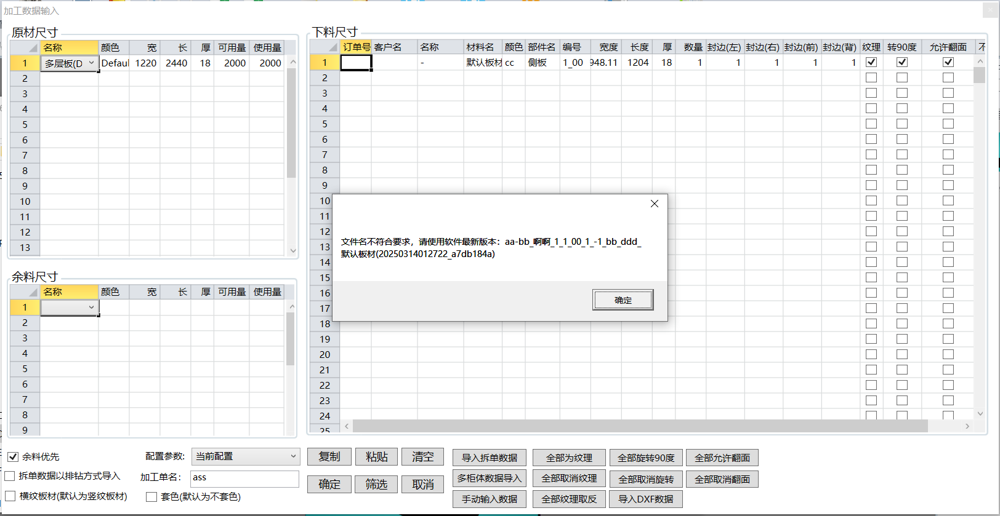
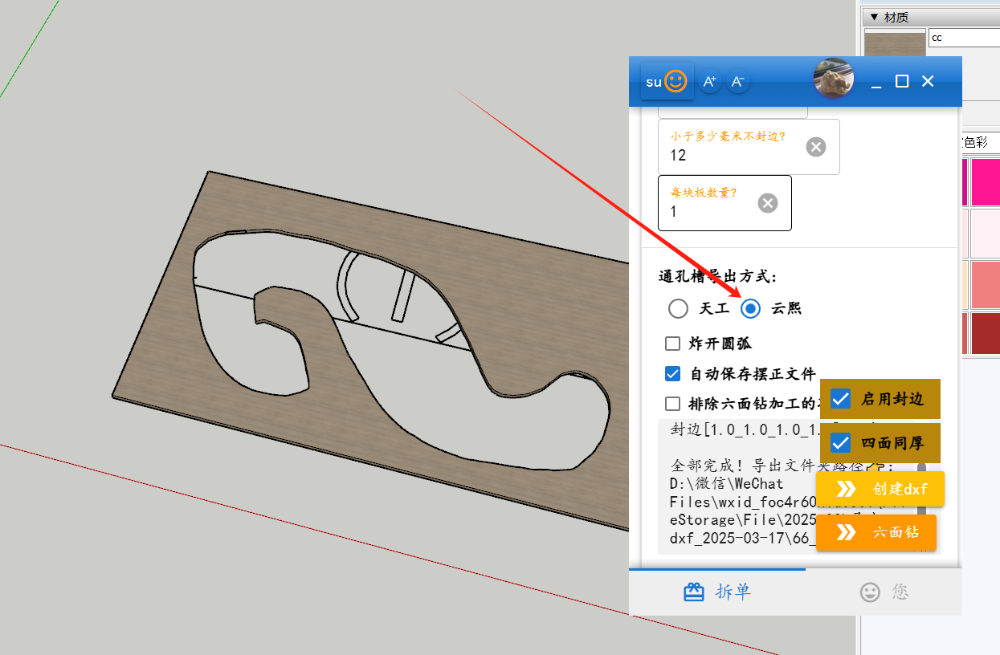
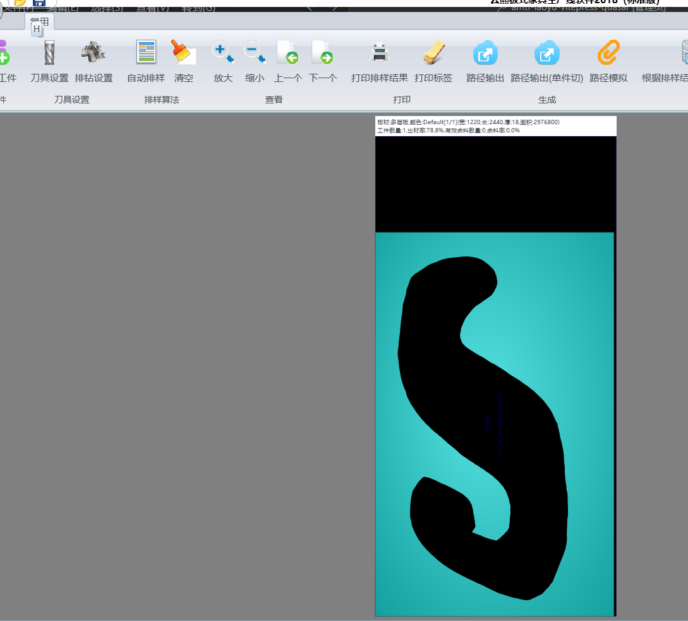

# 问答
## 导出dxf，别人电脑上可以，偏偏我这不行😓
+ 现象：
  自己电脑上点击导出dxf后，在中途停止了，在别人电脑上却没有。
打开su控制台，有报错信息“Error: #<NoMethodError: undefined method `/' for nil:NilClass>
C:/Users/Administrator/AppData/Roaming/SketchUp/SketchUp 2022/SketchUp/Plugins/amtf_ly/adaochu/Adaochu.rb:1811:in `进行逆时针排序点s'”
+ 解决办法
  到afu321上去下载su安装包，重新安装
+ 可能原因
  其他途径下载的安装包，可能是功能不全的版本

## 云熙报错:文件名不符合要求？
+ su材质名称不符合要求，在su中修改下

## 异形孔怎么搞？
+ 曲线如果不是一整条的话，需要先在su里面焊接成一整条
+ 导出dxf那里选`云熙`

## 六面钻什么情况、怎么使用？
部分细节还待敲定，目前还未通过正式生产测试！

使用步骤:
1. su导出dxf到和谐天工，加工外轮廓和`内轮廓`(内轮廓是指通孔、通槽)
    + 存在的问题：和谐天工，加工刀具设置成排除二合一孔的时候，会把`内轮廓`也排除掉
      + 可能的解决方案，su导出dxf的时候，不导出二合一孔，目前老鱼su插件好像未解决
2. su导出ban文件对接六面钻
   + 存在的问题，`内轮廓` 已经在天工中加工，ban文件中应该标记为`已加工`，目前老鱼su插件好像已解决

建议：
确实需要六面钻功能的用户，先用简单零件测试，感觉流程能走通，只是以上细节需要完善的话，再在交流群里面
交流组团。如果能集齐十个以上愿意预充电成为老鱼su插件`更上层楼会员`的用户，会提高该功能的完善优先级。

当然，得闲老鱼也会自行完善该功能。

## su的材质如何和开料软件(云熙)对应？

## 如何删除旧连接件？

## 清单设置？

## 全封边？
