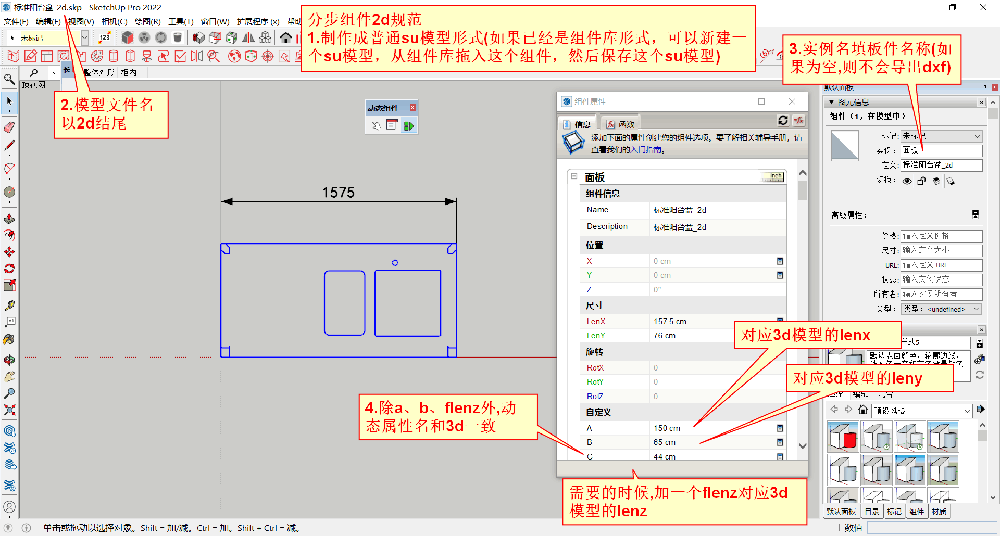

# sketchup动态组件兼职建模_120块每对组件_小白亦可

## 任务简介
给不锈钢钣金件制作的盆、柜，建立su动态组件的3d模型+2d展开图模型

报酬如标题，目前大概有一两千块钱的建模任务，老板业务能力很强，后续还有戏……

su小白亦可，主要靠自学，辅导只是辅导。到B站找一下su基础教程+su动态组件教程，学习下就能入门，多动手实操就能深入。

任务简单来说，就是搭方盒，盒子的原点定位在哪里，盒子的长宽高是多少；复杂来说，真的还不如去搬砖，毕竟人家赚得多……

## 具体要求

