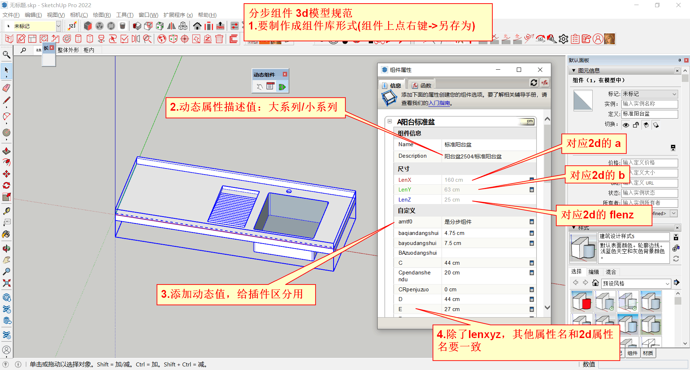

# sketchup动态组件兼职建模_120块每对组件_小白亦可

## 任务简介
+ 给不锈钢钣金件制作的盆、柜，建立`su动态组件的3d模型`+`2d展开图模型`
+ 报酬如标题，目前手头大概有`一两千块钱`的建模任务，老板业务能力很强，后续还有戏……别问还有多少戏，毕竟咱们的目标是兼职赚点零花钱，不要想太多
+ 可以根据组件的复杂度`适当议价`
+ 去年看过类似广告的请注意，今年有改进，`只需要会su动态组件`就能完成任务，不再需要了解任何编程内容
+ `su小白亦可`，但是相关技能`主要靠自学`，我只能略微指指点点一下……到B站找一下su基础教程+su动态组件教程，学习下就能`入门`，多动手实操就能`深入`，如果想接单，先提交一个自己做的动态组件例子
+ 工作内容，简单来说，就是`搭积木`，每个积木的原点定位在哪里，每个积木的长宽高是多少；复杂点来说，还真不如去搬砖，虽然人家不用脑壳痛，但是人家赚得多……
+ 正在做的组件可调参数有点多，不适合用来演示，有人有兴趣接单的话，再找例子演示
+ 有意接单者，需要交360元保证金，后续每完成一对动态组件退回120元

## 具体要求

## sketchup动态组件简单教程
这里从零开始，演示一下上面提到的su动态组件的创建过程

这次排除掉专用插件相关的内容，降低难度以免混乱

如果能独立完成演示的例子，可以考虑接单👆赚点外快

### sketchup(su)(草图大师)的应用领域
b站搜一下

### 实例整体用法
1. 3d动态组件：用来给用户调整尺寸
2. 对应的2d动态组件：3d组件中各个子组件展开后的样子
3. 定制的插件：把3d中的参数，复制给2d,导出成cad,用来排版开料
>演示用到的专用插件不需要了解，不对外提供，后续只需要关注如何建立动态组件这部分

### 下载su
http://afu321.com/18817.html

### 动在哪里？
这里主要关注尺寸、位置……

更复杂的用法，可以参考afu321的组件

### 实操……

