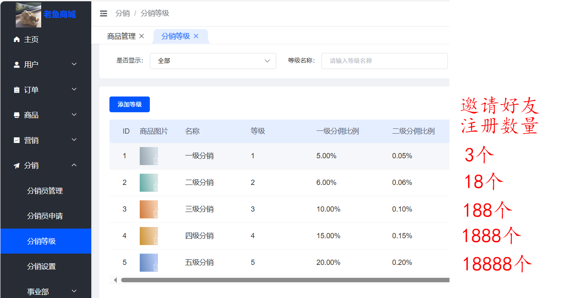

# 老鱼商城
搬运自 [众邦科技/CRMEB开源商城系统↗开源版本](https://gitee.com/ZhongBangKeJi/CRMEB) 

二级分销、砍价、拼团、秒杀等各种自媒体营销招式都有

手机浏览器版本:https://sc.laoyu.xin/
扫码登陆：

小程序名称：莲手传递美好  (还在审核)

注意：支付和短信功能暂时没开通，省钱~~

## 莲手推广
诚邀销售人才伸出莲手帮忙推广😄

推广方式：`登陆商城=》点底部 我的 =》点 我的推广 =》点 推广名称 =》发送给好友`

然后，好友可以扫码登陆老鱼商城，注册后，商城会记住您是他的推广大使，

以后他在商城的所有消费，您都会有相应的提成

具体提成比例如下：

## 代售
如果您愿意，可以联系老鱼在本商城发布商品
1. 推广大使的提成，通常要按上面的规则，也可以单独协商设置
2. 本商城另外收取服务费，售价的1%

## 自己部署独立的商城
老鱼这里可以提供安装、使用指导、二次定制开发，价格见[老鱼商城↗](https://sc.laoyu.xin)

其他运营费：
+ 冷门域名：100多/年 
+ 云服务器：1500多/年
+ 微信小程序认证费：300/年
+ 短信推送费:较低
